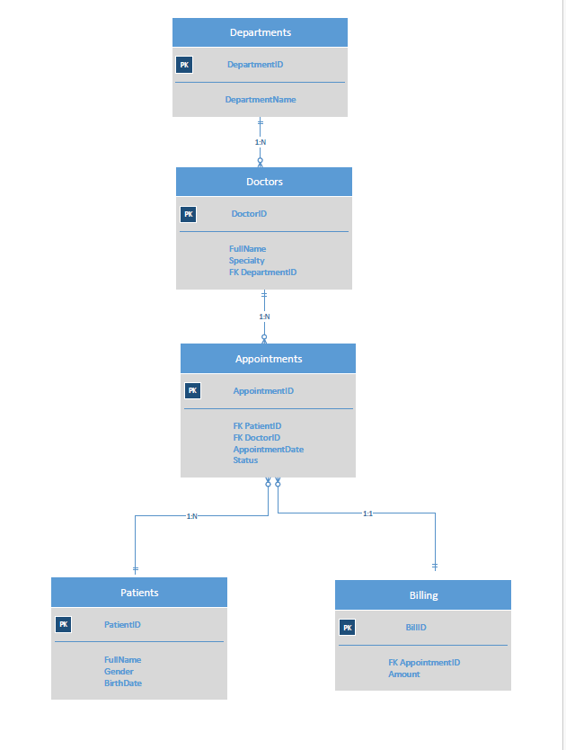
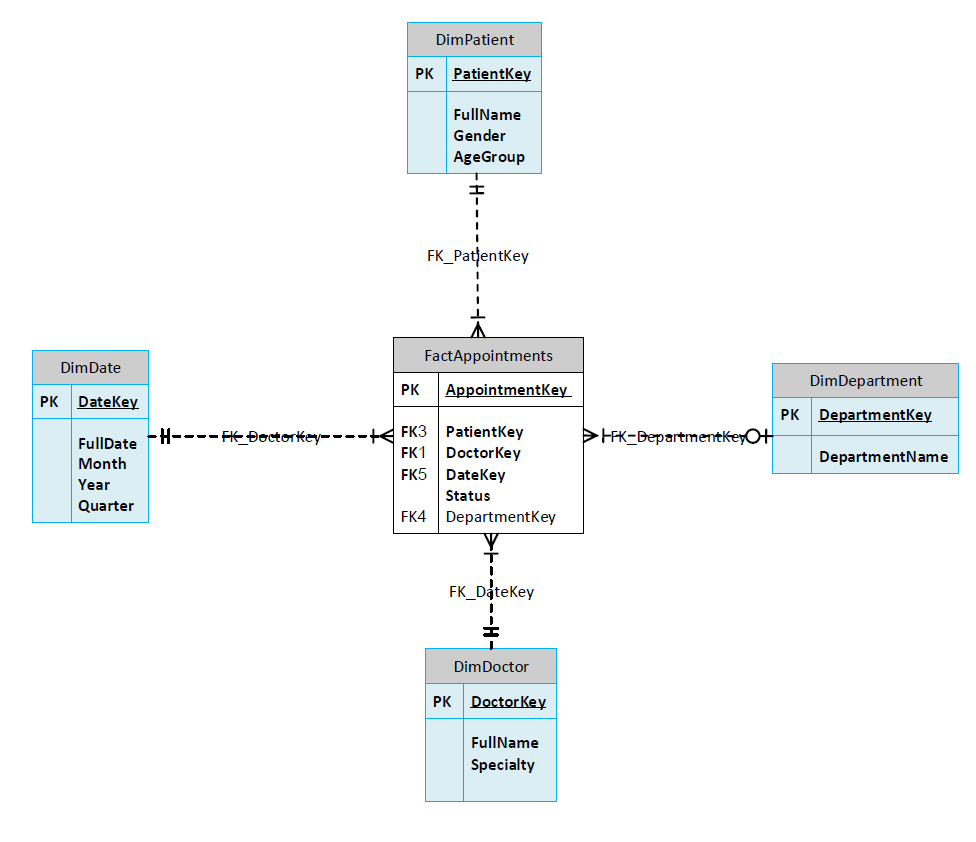

# Healthcare Data Warehouse

## Project Overview

This project demonstrates the design and implementation of a Healthcare Data Warehouse using Microsoft SQL Server.

## Technologies

- Microsoft SQL Server
- SQL Server Management Studio (SSMS)
- Data Warehouse Modeling
- Star Schema
- ETL Concepts

## OLTP Database Design

## Data Warehouse Star Schema

## Project Structure

- `sql/` : SQL scripts
- `docs/` : Diagrams and documentation

## Author

Beritan Ahmadzade
